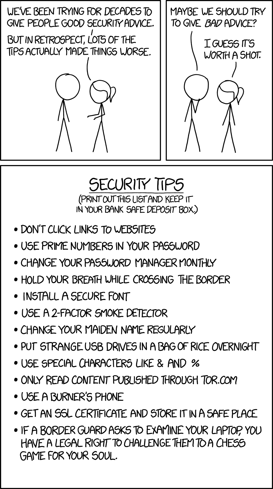

Hello World!

No matter which cloud provider you choose, you can't escape working with its IAM serice. Let's recall the basics and start fresh with IAM on GCP.

> IAM is a big topic, and when it comes to details, there are things that are very cloud provider specific. In order to keep this article useful for all, I'm going to focus on the basics of what is IAM, and give some examples on how Google Cloud implements it.

This way, there is nothing preventing you from applying this to other cloud providers... _The last thing you want to read is a rewording of the official documentation!_

On GCP, it's called [Cloud IAM](https://cloud.google.com/iam). On AWS, it's called [AWS IAM](https://aws.amazon.com/iam/). And on [Microsoft Azure](https://azure.microsoft.com/en-us/product-categories/identity/), it's... You've got the point!

Every descent cloud provider has an IAM service, and there are very few differences between them. Knowing one of them is enough to know the others.

## 🤔 Why on Earth do I Need an IAM?

IAM stands for **Identity and Access Management**.

If you are concerned about the security of your application, you must use IAM. IAM is what will define who can access which service, what they can (and can't) do with it, and how they do it.

It's not only people accessing services, but also applications (or even microservices) accessing them or each other.

This will require you to ask security questions early in the process of architecting your application. After all, if you don't know who can do what, what's the point of creating an architecture then?

> You don't want to keep everything open and unrestricted. Otherwise, sooner or later, there will be consequences, and an exploding billing is the least problematic one.

## 🗝 Key Concepts

Let's start with some terminologies.

But first, as I said earlier, we're going to study IAM with the point of vue of Google Cloud Platform. This means many terminologies of IAM might not be the same on other cloud providers, but many times it's just a naming difference.

Concepts of IAM can be split into two: Identity related concepts are the members, and Access Management concepts are permissions, roles and policies. Here I added "Resource" concept just to be clear on this notion.

### Members

Members in Cloud IAM are users (developers, marketing dep., ...) and applications (microservices, 3rd party applications,...).

Every time you find yourself asking **who needs access to something, that's a member.**

There are 4 kind of members:

- **Google Account**: It's the end user (a developer, an ops, a manager, John from the accounting dep., ...etc) with an `@gmail.com` email address.
- **Service Account**: This is for microservices, applications and virtual machines.
- **Google Group**: This is for `@googlegroups.com` Google groups.
- **Cloud Identity or G Suite domain**: Pretty self explanatory! You can connect your `custom@your-domain.com` to Google Cloud.

The common trait is that a member must have an email address. **Service Accounts** for example get an email address generated by IAM.

There is a lot to say about members, but this is anough to understand the basics. Let's move on permissions...

### Resources

They are Google Cloud services that you need for your project. And every resource has a list of operations.

A resource example might be Google Cloud Storage, and the operations on this resource are: Create a bucket, add objects to that bucket, remove them, set permissions, list objects,... etc.

### Permissions

They are authorizations you grant on resources. They determine **which operations** are allowed for **which resources**.

This is where you define that John, our friend from the accounting department, can access a file on Google Cloud Storage, but never create files in it. Because creating files, is the reponsability of our app, that can create, but not read them.

GCP has a very advanced permissions system. This is where you'll spend most of your time fine tuning your IAM system. This is also where changes will most often occur when building your applications.

??? Search more

### Roles

A Role is a collection of permissions. For example, you might want to create a custom developer role that has some authorizations on App Engine, Cloud Run and Google Cloud Storage, but not all admin rights for that resources.

At the beggining, things were quite simple on GCP. There were only 3 roles (note that they still exist, they are called **Primitive Roles**):

- **Viewer** role grants access to read only actions on GCP resources.
- **Editor** role includes a read and write actions on GCP resources. By write actions, I mean modifying states of resources like creating a bucket and adding objects to it.
- **Owner** role includes __Editor__ role permissions and the ability to manage roles and permissions on the project, and set up billings.

Note that there is a restriction on authorizations from viewer to editor to owner, like cocentric circles:

Simple, right? So why make things complicated?

Well, it turns out that the more mature your solution gets, the more granular permissions you need.

You might want to provide teams of developers different access depending on their project. This includes access to some services, but not all, like Google Cloud SQL, but not BigQuery.

Or it might be authorizing an application to access objects in a Storage bucket. But the bucket creation can only be done by another application.

If you stay in the old vision of managing roles with viewer/editor/owner split, you can't fine grain your authorizations. Ans real world applications need fine grain authorizations, don't they?

Enters the more complicated but correct role organization.

Now in addition to primitive role, you now have access to **Predifined roles** and **Custom roles**. Both provide granular accesses to resources.

[Predefined roles](https://cloud.google.com/iam/docs/understanding-roles#predefined_roles) are roles managed by Google Cloud. In the previous link. you'll find the list of predefined roles for GCP resources.

Here is an example of Google Pub/Sub predefined role:

| Role | Title | Description | Permissions | Lowest Resource |
| --- | --- | --- | --- | --- |
| roles/pubsub.subscriber | Pub/Sub Subscriber | Provides access to consume messages from a subscription and to attach subscriptions to a topic. | pubsub.snapshots.seek   pubsub.subscriptions.consume   pubsub.topics.attachSubscription | Topic |

In this example, the `roles/pubsub.subscriber` role includes three permissions: `pubsub.snapshots.seek`, `pubsub.subscriptions.consume` and `pubsub.topics.attachSubscription`. As you can see, all of three belongs to the same resource `pubsub.*`.

The last role type is [the Custom Role](https://cloud.google.com/iam/docs/understanding-custom-roles) in which you are free to pick any permissions, and group them into a single role to grant users.

There is a lot to say about custom roles, but this post will end up copying the official documentation linked earlier. Just be sure to know the[ limitations of custom roles](https://cloud.google.com/iam/docs/understanding-custom-roles#known_limitations) before jumping head first with this role type.

Now that we've seen what are roles, let's link them to members using policies.

### Policy

A policy links a member to a role. In our example, Neo, a fresh hire in IT dep., will be granted a role of `IT-guy` which will give him all the necessary permissions as his colleagues.

It might still looks complicated, but as you can now see, it handles a lot of use cases for all organization types.

Roles here play a central role of grouping permissions. Members are then granted roles using policies.

It is of course possible to grant a member special permissions, but this is not a best practice, as we detail in the next section.

## 🤯 Order and Chaos

There are a few sets of best practices, and ignoring them can head you to some troubles.

For example, every member accessing your infrastructure should have its own key. This way, when this person leaves the organization, or the application does no longer exist, you just need to revoke his access keys.

Members are grouped by roles, this way updating an access to one member will be replicated to other members.

Give members the minimum required permissions to get the job done. This is very important! It's so easy (and tempting) to grant admin rights to everybody, but when something goes wrong, the headaches that result rolling back things are really not worth the headache of setting the proper permissions from the beggining.

> As with everything in life, there is debt on everything you postpone. The question is: Can you afford that debt?

There should be only one person (or a determined set of people) who can grant permissions. Usually this is an Ops role, and the reasons for that are pretty obvious: Keep permissions under control. The only exception is if you're a solo entrepreneur building the next Unicorn company, but except that, you better restrict who is the owner of the infrastructure rights.

---

## 👋 Take away

IAM can quickly gets confusing. But if you rely on basics, you will drastically reduce its overhead, while maintaining a solid authorization structure for your organization and projects.

Keep the previous complete schema at hand, and come back to it when things get confusing. If you have any question, please feel free to ask it in the comment section below.

Cheers,

Hassen
