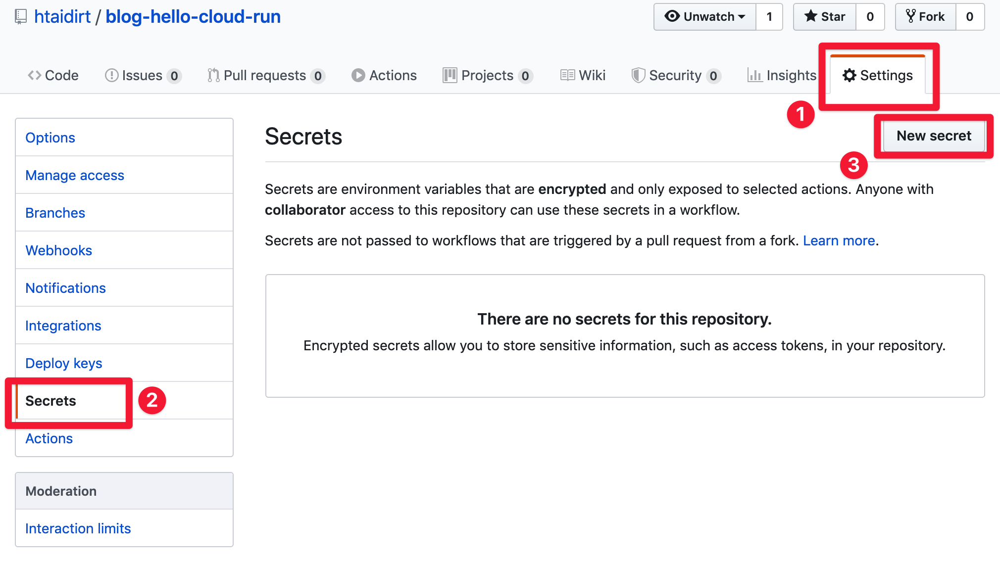

Hello World,

I don't know if you're developing web apps and APIs for long, but it's becoming easier than ever to deploy and maintain those solutions thanks to serverless technologies. Recently, GCP launched Cloud Run as a new serverless solution to deploy web applications.

In this post we are going to explore Google Cloud Run through a very simple web API. Deployments to Cloud Run will be done through Github Actions triggered after every push to our code base.

With all that said, let's go!

---

## 🧐 First, what is Cloud Run? And why it's so amazing?

According to [Google Cloud](https://cloud.google.com/run), Cloud Run is a:

> Fully managed compute platform for deploying and scaling containerized applications quickly and securely.

In plain English, Google Cloud Run is a service that lets you easily deploy your Docker container to GCP cloud, and it automatically manages the lifecycle of your containers (provisioning, scaling up and down, and shutdown).

Cloud Run is based on [Knative](https://knative.dev/), which is a Kubernetes-based platform to deploy and manage modern serverless workloads.

This means that instead of creating and managing your own Kubernetes infrastructure, then install and configure Knative to access the advantages of Serverless applications, you can rely on Cloud Run which does all of this for you.

Container based serverless approach is different from Function as a Service serverless approach, in the way that you keep developing the way you and your team are used to. There are "fewer" restrictions on the way you must deliver your code in order for the cloud provider to run it and managed on your behalf. As long as you provide a Docker container that is runnable, and exposes the right port, there is no reason why it can't be deployed.

Cloud Run automatically provides a REST endpoint to deployed applications. Incoming requests are sent to the container server through port 8080.

Like most of serverless solutions, Cloud Run is a pay-per-use service. It also has a generous free tier of 2 million requests free per month. Have a look at the [pricing page](https://cloud.google.com/run/pricing) for more details.

For all of this, Cloud Run can be a good solution for you and your team to test your API or app on the cloud without much hassle and expense.

The following post will quick start you into Cloud Run by creating a simple Hello World API, and setup for a basic CI/CD pipeline to automate your deployments.

## 🗺 Battle plan

The reason I wanted to go this way, instead of deploying using clicks and checks on Cloud Run UI, is that it describes how we really deploy web apps in the real world. This is not just a quick and dirty approach to deploying web applications, but a sustainable, yet still simple, approach to deploy production grade web applications.

Your local application, Github and Google Cloud Platform all communicate using the following schema:


You're going to first create the API on your local machine. Once happy with the result, you push your changes to Github which triggers a Github Action to build the image to Google Cloud Registry. When done, Action will create a Cloud Run app and gives it the image location on the registry. Cloud run will start a container with the API then setup an endpoint to access it.

This is a very basic CI/CD pipeline. Of course, there is a ton to say about DevOps, but for simplicity sake, we're going to keep it simple using the schematized process.

But first, we will need to do some setups on GCP and Github. Note that you need to do this only a once (or few couple of times) in the lifetime of your app.

## ☁️ Setup GCP

Google Cloud offers $300 of free credits for new subscriptions, within the first year. If you don't already have a GCP account, you can create a new one here.

Google Cloud is organized in projects, so the first thing to do is create a new project.

### Create new project

Login to your [GCP console](https://console.cloud.google.com/), and create a new project.


At the end, note the **Project ID**; You'll need it to create a secret containing its value. To access Cloud Run, you can list services through the top-left menu, or using the "Search products and resources" nav search.


### Create a service account for Github Actions

Because we need to allow Google Actions to build the artifact, and deploy on Cloud Run, we have to grant access and rights to some GCP services for Github.

In the top search bar, search for "Service Account". This is the interface in which we create roles and grant authorizations.


Create a new service account for Github Actions:


A service account is equivalent of a user. In our case we created a user named "Github Actions" and we're going to give information of that user to Github to properly setup Actions.

You next need to give this user rights to do stuff on your behalf. Give your Github Actions the following roles:

- Service Account User: This allows Github Actions to run the operations as the service account.
- Cloud Build Editor: We need to allow Github Actions to create and delete builds.
- Cloud Run Admin: This gives full control over Cloud Run resources.
- Viewer: Gives Github Actions read access to all resources.

> From a security perspective, it's very important to restrict, as much as possible, accesses and authorizations for the services we are using.


In the next step we can generate and download a key to give Github Actions to authenticate to GCP. Create a new key of type JSON. Once created you'll start downloading the key locally. **Keep it safe and do not share it publicly, or anyone can create builds and Cloud Run deploys.


Once done, you'll see your new service account on the dashboard. In addition to the downloaded file, you'll need to copy the email and key ID of your new services accounts for the pipeline.


That's all for GCP setup. Time to give Github the necessary information to interact with GCP.

## 🕹 Setup Github Actions

I'll not explain how to create a new repo and push the codebase on it ;) Once done, head to "Settings", then to "Secrets" section to create a "New secret".



Our pipeline needs the following 2 secrets:

| Name | Value to give |
|-|-|
| `RUN_PROJECT` | The Project ID your created |
| `RUN_SA_KEY` | The Base64 encoded content of your downloaded key |

To get the Base64 encoded key, run the following bash command:

```bash
cat /path/to/your-downloaded-key.json | base64
```

Copy the content of that result as the value of `RUN_SA_KEY`.


Now that we setup both GCP and Github, it's time to get our hands dirty with some code.

## 🛠 Create a basic API with ExpressJS

First things first, let's create a basic REST API with ExpressJS framework. It all starts with initializing a NodeJS app.

```bash
mkdir hello-cloud-run
cd hello-cloud-run
npm init -y
```

We next install ExpressJS package with `npm install --save express`. This produces the following **package.json** file:

```json
{
  "name": "hello-cloud-run",
  "version": "1.0.0",
  "description": "",
  "main": "index.js",
  "scripts": {
    "test": "echo \"Error: no test specified\" && exit 1",
    "start": "node index.js"
  },
  "keywords": [],
  "author": "",
  "license": "ISC",
  "dependencies": {
    "express": "^4.17.1"
  }
}
```

The only difference with your result, is that I manually added line 8 to ask `npm start` to run `node index.js`. This means our web server should be in **index.js** file. Let's create a basic HTTP server in it:

```javascript
const express = require('express');
const app = express();
const PORT = process.env.PORT || 8080;

app.get('/', (req, res) => {
  res.json({ message: "Hello World!" });
});

app.listen(PORT, () => {
  console.log('Listening on port', PORT);
});
```

This should be obvious. We create a web server that listens on port 8080 (if not specified in the environment) and exposes only one _GET_ route that answers "Hello World!".

A simple `npm start` should to the start. You can check it works by visiting _localhost:8080_ using your browser or `curl`.

Now is time to dockerize our application.

## 🐳 Dockerize the app and test locally

Create a **Dockerfile** file with the following content:

```Dockerfile
FROM node:12-slim

WORKDIR /app
COPY package*.json ./
RUN npm install --only=production

COPY . ./

EXPOSE 8080
CMD [ "npm", "start" ]
```

Our application image starts with a lightweight Docker image of Node 12.

> Controlling the size of our application image is important. This is because Cloud Run will first need to pull it before launching our server. The heavier the image, the longer it takes to cold start the server.

The remaining Dockerfile lines are straight forward: We define a working directory, copy only package files to install them in the container, copy the remaining files and finally start the server.

Usually, you don't want to copy all the local files of your project in the container. Ignore some files by creating a **.docker-ignore** file:

```
node_modules/
Dockerfile
**/*.log
```

We can now build our Docker image and gie it a tag _hello-cloud-run_:

```
docker build -t hello-cloud-run
```

And run our container (note the `--rm` which automatically deletes the Docker container after exiting it):

```
docker run --rm -p 8080:8080 hello-cloud-run
```

Again, visiting your browser at _localhost:8080_ should prove it works.


## ⚙️ Create Github Actions yaml file to build the app

Now that we have a working REST API, let's create the pipeline that will build and ship it to Cloud Run. This process must be done in a yaml file and respect Github Actions syntax and requirements.

The folks at Google Cloud already created an example of a Github Action creating a Cloud Run service. You can copy/paste their example and tweak according to your needs. That's what I did in the example below, which I saved in **.github/workflows/cloud-run.yml** file:

```yaml
name: Build and Deploy to Cloud Run

on:
  push:
    branches:
    - master

env:
  PROJECT_ID: ${{ secrets.RUN_PROJECT }}
  RUN_REGION: us-central1
  SERVICE_NAME: hello-cloud-run

jobs:
  setup-build-deploy:
    name: Setup, Build, and Deploy to Cloud Run
    runs-on: ubuntu-latest

    steps:
    - name: Checkout
      uses: actions/checkout@v2

    # Setup gcloud CLI
    - uses: GoogleCloudPlatform/github-actions/setup-gcloud@master
      with:
        version: '290.0.1'
        service_account_key: ${{ secrets.RUN_SA_KEY }}
        project_id: ${{ secrets.RUN_PROJECT }}

    # Build and push image to Google Container Registry
    - name: Build
      run: |-
        gcloud builds submit \
          --quiet \
          --tag "gcr.io/$PROJECT_ID/$SERVICE_NAME:$GITHUB_SHA"

    # Deploy image to Cloud Run
    - name: Deploy
      run: |-
        gcloud run deploy "$SERVICE_NAME" \
          --quiet \
          --region "$RUN_REGION" \
          --image "gcr.io/$PROJECT_ID/$SERVICE_NAME:$GITHUB_SHA" \
          --platform "managed" \
          --allow-unauthenticated
```

We first start by naming our workflow and defining its trigger condition (in this case, any new push to master branch). The reason is because we can create many workflows that trigger independently given some conditions. Those workflows are other yaml files stored in **.github/workflows/** folder.

We next define some environment variables. Those will be referenced later in the _jobs_ section, but first notice the use of `${{ secrets.RUN_PROJECT }}` on line 9; Here we are using Github secrets feature to send the pipeline some sensitive variables, like the project id in this case. We will use secrets later in the yaml file to give the job our Google Service Account key.

Then we finally execute the steps. On a `ubuntu-latest` machine, we first checkout/get our codebase (on lines 19 and 20), and setup `gcloud` (from line 23 to 27). `gcloud` is Google Cloud's CLI which we will use to build and deploy our app. It means we need first to install it on our Action `ubuntu-latest` machine before processing.

For that, we use the `uses` yaml attribute which points to a Github repo and folder [`GoogleCloudPlatform/github-actions`](https://https://github.com/GoogleCloudPlatform/github-actions/tree/master/setup-gcloud) and branch `master`. Think of it like a plugin that install all what is necessary to deal with GCP.

Next step is to build the docker image and push it to GCR: Google Cloud Registry. We can do the same building locally and pushing to GCR but using `gcloud builds submit` will do all what is necessary to ensure it works (including using the right settings). **Note that we are using Cloud Build service to build and deposit the artifact in GCR.**

Note that the docker image we use is the one specified in the environment variables, and the tag is Github SHA of our commit. `$GITHUB_SHA` is an environment variable that was added automatically to Action and [there are many more](https://help.github.com/en/actions/configuring-and-managing-workflows/using-environment-variables).

The final step is to deploy our app to Cloud Run. Again, we are using `gcloud` CLI to achieve that (from line 37 to 44). The noticeable things are:

- We provided the image location using `--image` parameter. This is the location we build our image onto in the previous step.
- We used `--platform "managed"` to tell Cloud Run to manage the app on our behalf.
- We added `--allow-unauthenticated` to allow all requests to our app without authentication. This is best for public APIs and apps.

I encourage you to [skim the doc](https://help.github.com/en/actions) if I went too quick on something. There's a ton to learn!

## 🚀 To the moon

Once you finish creating the pipeline, it's time to commit your changes. When you push your work to your Github repo, this will automatically trigger Github Action pipeline for you 🎉

_Nota: You might experience the following error on the build process when running jobs for the first time:_

```
ERROR: (gcloud.builds.submit) User [github-actions@***.iam.gserviceaccount.com] does not have permission to access project [***] (or it may not exist): Cloud Build API has not been used in project 1234567890 before or it is disabled. Enable it by visiting https://console.developers.google.com/apis/api/cloudbuild.googleapis.com/overview?project=1234567890 then retry. If you enabled this API recently, wait a few minutes for the action to propagate to our systems and retry.
```

_Follow the provided link to activate Cloud Build service. This ensures you know what you're doing when using a GCP service; You'll encounter this often when using new GCP services. It has to be done only once._

_Re-run the failed job:_


The next run should be successful. Deployment to Cloud Run should output the URL of your service:


Visiting this page should output the same output as shown running it locally:


With one small difference... Note we're not using port `8080` when running on Cloud Run. This is because Cloud Run always map the public port `80` of your app to the port `8080` of your container. That's why it was important to make our server listening to port `8080` and expose it from Docker through this port.

Note that Cloud Run will not change the provided URL after updates. This will ensure you get the same test URL when making changes to your code base.

One missing last step is to map the provided Cloud Run URL to a fixed domain name. This will be the subject of a future post.

Going to the GCP console of Cloud Run will show your deployment live with some metrics:


You can have many useful information about how your service is doing, including a handy logging interface. But the interesting tab for you now is **YAML** tab. Here you can see how your Cloud Run service translates into Knative service. If you want one day to have your own Kubernetes cluster with Knative, you can find good inspiration on how things were doing in the background of Cloud Run.


> Cloud Run is just a managed Kubernetes cluster with Knative enabled.

---

## 👋 Final words

This was a long project, but hopefully it gives you some idea on how to structure and automate a real project. Github Actions is a very simple CI/CD solution to create and manage simple pipelines. It also integrates very well with Github ecosystem and has a growing community of developers that create and maintain plugins.

On the other hand, GCP Cloud Run is a very simple way to create web applications and services, thus allowing you to quickly demonstrate your work, and deploy your solution with minimal cost.

I hope you enjoyed this post as much as I enjoyed writing it. I really would like to have your feedbacks on the topics mentioned here, or how you are going to use Cloud Run for your projects.

Cheers,

Hassen
